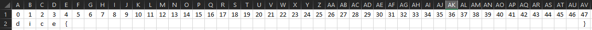
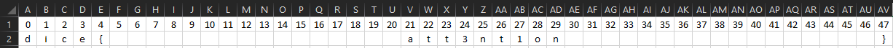
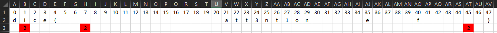
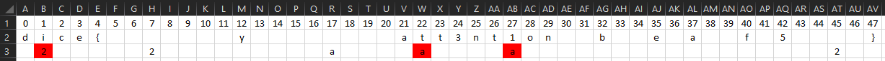
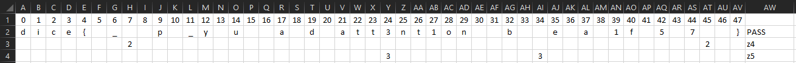
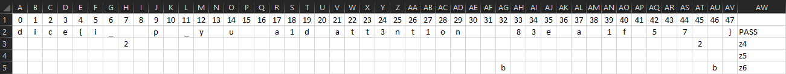
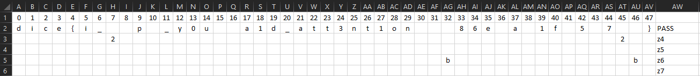
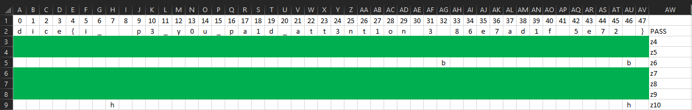
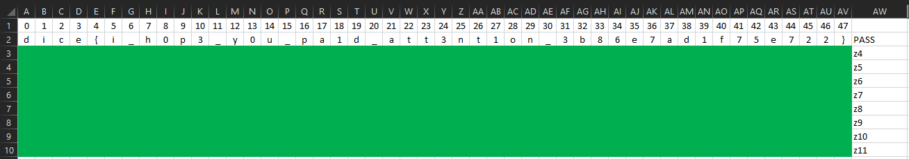

# Comprehension and Run

The first thing I did was to read the files we were given :
- `run.py` => Gives us an example of how to run the file `berry.rasp`
- `berry.rasp` =>  Contains the checks for the flag, but I'll talk about that later
- `Dockerfile` => Contains the commands to mount the docker, but especially the modules to install

Not being able to launch the docker in the state, I decide to do the same things on my pc. So I installed the python and git clone modules of RASP.

Once the installation is ready, I decide to launch the program for the first time.
When I run it, I notice that the `s-op: z<int>` correspond to `if` with a boolean represented by `[F]` or `[T]`.

So we know that the program will make 12 checks on the password.
  
# Deduction

First of all, if we look at the `rasp` file we can notice two things easily.

`z0 = (selector_width(select(1, 1, ==)) == 48);`

The z0 check can be understood as a check that the password length `select_width` is equal `==` to `48`. It could be translated into python as `len(password) == 48`.

Now that we know the length of the password we can write a flag such as `dice{XXXXXXXXXXXXXXXXXXXXXXXXXXXXXXXXXXXXXXXXXXXXXXXXXXXXXXXX}` and we actually pass the first verification of the program.

At this point, I decide to make an excel, don't ask me why, putting a column for each character.

We start well, we know the length of the password and we validate the first step out of the twelve. Only the first step? No, we also validate the second step, but why?

If we take the `z1` check, and keep only the last use :

*On each line the code is repeated several times, so I only care about one occurrence, in this case the last aggregate*

    aggregate(
		select((selector_width((((((
			select(0, 0, !=) or (
			
			select(tokens, "d", ==) and 
			select(indices, (indices + 0), ==))) or (
			
			select(tokens, "i", ==) and 
			select(indices, (indices + 1), ==))) or (
			
			select(tokens, "c", ==) and 
			select(indices, (indices + 2), ==))) or (
			
			select(tokens, "e", ==) and 
			select(indices, (indices + 3), ==))) or (
			
			select(tokens, "{", ==) and 
			select(indices, (indices + 4), ==)))) == 5),
			
			True, ==), indices, -1)) == 0));

We see that the code does a `==` check with characters `d`, `i`, `c`, `e` and `{`.
To better understand this code, we could replace it with python code like this:

    pass[indices+0] == "d"
    pass[indices+1] == "i"
    ...
    OR
    ...
    pass[indices:indices+5] == "dice{"

Very well, but what does `indices` represent? We know that `dice{` is at the beginning of the flag so we want `indices + 0 == 0` so `indices` starts at `0` and magically we find a `0` in the last line. Going back to what we saw before:

    pass[0+0] == "d"
    pass[0+1] == "i"
    ...
    OR
    ...
    pass[0:5] == "dice{"

This is how we validate the second verification of the program 

Coincidence?

# Found logic

Ok, I guess I understand how the program works, let's try with the operation `z2` :

    aggregate(
	select((selector_width((
	select(0, 0, !=) or (
	
	select(tokens, "}", ==) and 
	select(indices, (indices + 0), ==)))) == 1),

	True, ==), indices, -1)) == 47));

Using the logic from before, we already look at our `47` index and look at the verification performed

    pass[47+0] == "}"
  
Great, that's exactly how our flag is made.

To be sure of our logic let's check with the operation `z3` :

    aggregate(
	select((selector_width((((((((((
	select(0, 0, !=) or (
	
	select(tokens, "a", ==) and 
	select(indices, (indices + 0), ==))) or (
	
	select(tokens, "t", ==) and 
	select(indices, (indices + 1), ==))) or (
	
	select(tokens, "t", ==) and 
	select(indices, (indices + 2), ==))) or (
	
	select(tokens, "3", ==) and 
	select(indices, (indices + 3), ==))) or (
	
	select(tokens, "n", ==) and 
	select(indices, (indices + 4), ==))) or (
	
	select(tokens, "t", ==) and 
	select(indices, (indices + 5), ==))) or (
	
	select(tokens, "1", ==) and 
	select(indices, (indices + 6), ==))) or (
	
	select(tokens, "o", ==) and 
	select(indices, (indices + 7), ==))) or (
	
	select(tokens, "n", ==) and 
	select(indices, (indices + 8), ==)))) == 9),

	True, ==), indices, -1)) == 21));

If we apply our logic, the index is `21` and we want the characters to verify these conditions:

    pass[21+0] == 'a'
    pass[21+1] == 't'
    ...
    OR
    ...
    pass[21:29] == 'att3nt1on'

Very well, it looks like a word of a flag that, there is no more coincidence the logic is there, P.E.R.F.E.C.T!

I continue with the operation `z4`, shit we have a problem.

	...
    select(indices, (indices * 5) % 48, ==), tokens, "*"), "2", ==) and 
	select(indices, (indices + 2), ==))) or 
	select(indices, (indices + 3), ==)) or 
	select(indices, (indices + 4), ==))
	...

It's strange that we don't have only one possibility for a character, but several, however there is something that tells us what to do, the `or`, either we can translate it as :

    pass[((indices + 2) * 5) % 48] == "2"
    or pass[((indices + 3) * 5) % 48] == "2"
    or pass[((indices + 4) * 5) % 48] == "2"

We can confirm that it is a `or` because `((indices + 3) * 5) % 48 = 2` and `pass[2]` is necessarily equal to `i` of `dice`.

So let's see what our excel does with the `z4` operation:

So I put on the first line the characters without the `or` operation that we saw before and on the second line the two `or` of the program with in red the impossible characters. As you can see the character `a` is necessarily in `17` position since the other possibilities are impossible.

Operation `z5` in the same way:

Very well, we confirm some other characters, we continue `z6` :

Operation `z7` :

Operation `z8`, `z9` and `z10` with a little hesitation on the `h`:

Operation `z11`:

Very well, now we have our flag and for my part a first blood.

# FLAG

`dice{i_h0p3_y0u_pa1d_att3nt1on_3b86e7ad1f75e722}`

# Conclusion
The beauty of reverse is that you can understand how a program works without knowing the language.
