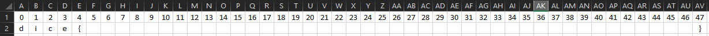
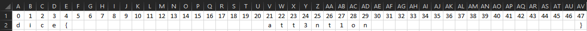
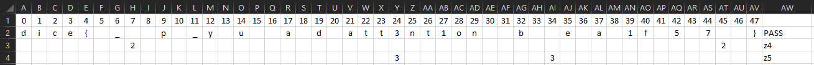
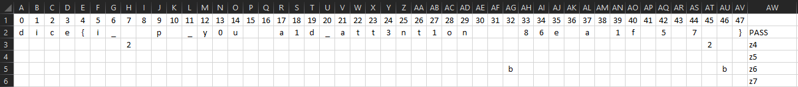

# Compréhension et Run

La première chose que j'ai fait c'est de lire les fichiers qu'on nous donne :
- `run.py` => Nous donne un exemple de comment lancer le fichier `berry.rasp`
- `berry.rasp` =>  Contient les vérifications pour le flag, mais j'en parlerai plus tard
- `Dockerfile` => Contient les commandes pour monter le docker, mais surtout les modules à installer

N'arrivant pas à lancer le docker dans l'état, je décide de faire les mêmes choses sur mon pc. Donc installation des modules python et git clone de RASP.

Une fois l'installation prête, je décide de lancer le programme une première fois
En le lançant je m’aperçois que les `s-op: z<int>` correspondent à des `if` avec un boolean représenté par `[F]` ou `[T]`.

Donc on sait que le programme va faire 12 vérifications sur le mot de passe.
  
# Déduction

Dans un premier temps, si on regarde le fichier `rasp` on peut remarquer deux choses facilement.

`z0 = (selector_width(select(1, 1, ==)) == 48);`

La vérification z0 peut être comprise comme une vérification de la longueur du mot de passe `select_width` est égale `==` à `48`. On pourrait le traduire en python comme `len(password) == 48`

Maintenant, qu'on connaît la longueur du mot de passe on peut écrire un flag tels que `dice{XXXXXXXXXXXXXXXXXXXXXXXXXXXXXXXXXXXXXXXXXX}` et on passe effectivement la première vérification du programme.

A ce stade-là, je décide de faire un excel, ne me demander pas pourquoi, en mettant une colonne pour chaque caractère.

On commence bien, on connaît la longueur du mot du passe et on valide la première étape sur les douze. Seulement la première étape? Non, on valide aussi la deuxième étape, mais pourquoi?

Si on prend la vérification `z1`, et qu'on garde seulement la dernière utilisation :

*Sur chaque ligne le code est répété plusieurs fois, donc je ne me soucie que d'une seule occurrence, en l'occurence le dernier aggregate*

    aggregate(
		select((selector_width((((((
			select(0, 0, !=) or (
			
			select(tokens, "d", ==) and 
			select(indices, (indices + 0), ==))) or (
			
			select(tokens, "i", ==) and 
			select(indices, (indices + 1), ==))) or (
			
			select(tokens, "c", ==) and 
			select(indices, (indices + 2), ==))) or (
			
			select(tokens, "e", ==) and 
			select(indices, (indices + 3), ==))) or (
			
			select(tokens, "{", ==) and 
			select(indices, (indices + 4), ==)))) == 5),
			
			True, ==), indices, -1)) == 0));

On voit que le code fait une vérification `==` avec des caractères `d`, `i`, `c`, `e` et `{`.
Pour mieux comprendre ce code, on pourrait remplacer par du code python comme ça :

    pass[indices+0] == "d"
    pass[indices+1] == "i"
    ...
    OR
    ...
    pass[indices:indices+5] == "dice{"

Très bien, mais `indices` représente quoi? On sait que `dice{` est au début du flag donc on cherche a ce que `indices + 0 == 0` donc `indices` commence à `0` et magie on retrouve un `0` en dernière ligne. En reprenant ce qu'on a vu avant :

    pass[0+0] == "d"
    pass[0+1] == "i"
    ...
    OR
    ...
    pass[0:5] == "dice{"

C'est comme ça qu'on valide la deuxième vérification du programme 

Coïncidence?

# Found logic

Ok, je suppose avoir compris comment marche le programme essayons avec l’opération `z2` :

    aggregate(
	select((selector_width((
	select(0, 0, !=) or (
	
	select(tokens, "}", ==) and 
	select(indices, (indices + 0), ==)))) == 1),

	True, ==), indices, -1)) == 47));

En utilisant la logique d'avant, on regarde déjà notre indice `47` et on regarde la vérification effectuée

    pass[47+0] == "}"
  
Génial c'est exactement comment est constitué notre flag.

Pour être sur de notre logique vérifions avec l'opération `z3` :

    aggregate(
	select((selector_width((((((((((
	select(0, 0, !=) or (
	
	select(tokens, "a", ==) and 
	select(indices, (indices + 0), ==))) or (
	
	select(tokens, "t", ==) and 
	select(indices, (indices + 1), ==))) or (
	
	select(tokens, "t", ==) and 
	select(indices, (indices + 2), ==))) or (
	
	select(tokens, "3", ==) and 
	select(indices, (indices + 3), ==))) or (
	
	select(tokens, "n", ==) and 
	select(indices, (indices + 4), ==))) or (
	
	select(tokens, "t", ==) and 
	select(indices, (indices + 5), ==))) or (
	
	select(tokens, "1", ==) and 
	select(indices, (indices + 6), ==))) or (
	
	select(tokens, "o", ==) and 
	select(indices, (indices + 7), ==))) or (
	
	select(tokens, "n", ==) and 
	select(indices, (indices + 8), ==)))) == 9),

	True, ==), indices, -1)) == 21));

Si on applique notre logique, l'indice est donc `21` et on veut que les caractères vérifient ces conditions :

    pass[21+0] == 'a'
    pass[21+1] == 't'
    ...
    OR
    ...
    pass[21:29] == 'att3nt1on'

Très bien, ça ressemble à un mot d'un flag ça, il n'y a plus de coïncidence la logique est là, P.E.R.F.E.C.T !

Je continue avec l'opération `z4`, merde on a un problème.

	...
    select(indices, (indices * 5) % 48, ==), tokens, "*"), "2", ==) and 
	select(indices, (indices + 2), ==))) or 
	select(indices, (indices + 3), ==)) or 
	select(indices, (indices + 4), ==))
	...

Bizarre on à pas qu'une seule possibilité pour un caractère, mais plusieurs, cependant il y a quelque chose qui nous indique ce qu'il faut faire, le `or`, soit on peut le traduire comme :

    pass[((indices + 2) * 5) % 48] == "2"
    or pass[((indices + 3) * 5) % 48] == "2"
    or pass[((indices + 4) * 5) % 48] == "2"

On peut confirmer que c'est un `or` car `((indices + 3) * 5) % 48 = 2` et `pass[2]` est forcément égale à `i` de `dice`.

Alors on va voir ce que donne notre excel avec l'opération `z4`:

Alors j'ai mis sur la première ligne les caractères sans l'opération `or` qu'on a vu avant et sur la deuxième ligne les deux `or` du programme avec en rouge les caractères impossibles. Comme on peut le voir le caractère `a` est forcément en `17` position puisque les autres possibilités sont impossibles.

Opération `z5` de la même manière :

Très bien, en plus on confirme certains autres caractères, on continue `z6` :

Opération `z7` :

Opération `z8`, `z9` et `z10` avec une petite hésitation sur le `h`:

Opération `z11`:

Très bien, maintenant on à notre flag et pour ma part un first blood.

# FLAG

`dice{i_h0p3_y0u_pa1d_att3nt1on_3b86e7ad1f75e722}`

# Conclusion
La beauté du reverse c'est de pouvoir comprendre comment fonctionne un programme sans connaître le langage.
